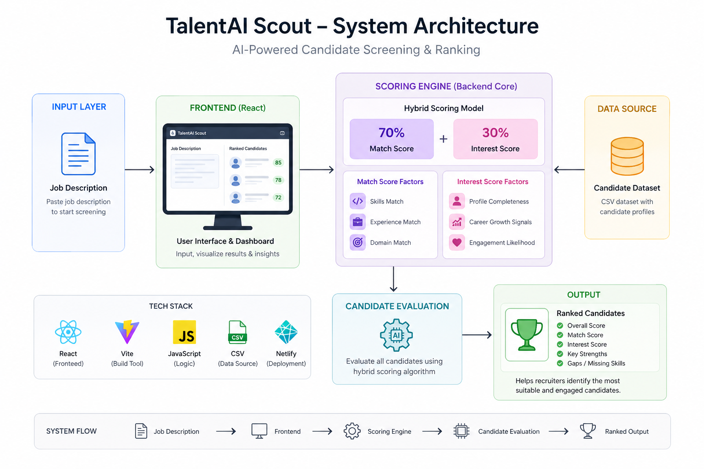

# TalentAI Scout 🎯
**Precision AI Talent Scouting Agent for High-Growth Teams**
 
TalentAI Scout is an end-to-end AI-driven recruitment platform that automates candidate evaluation, ranking, and shortlisting. It transforms hours of manual screening into seconds of intelligent, explainable, and data-driven decision-making.
 
---
 
## 🌐 Live Demo & Resources
 
| Resource | Link |
|---|---|
| 🌐 Live App | [ahana-catalyst-submission.netlify.app](https://ahana-catalyst-submission.netlify.app/) |
| 🎥 Demo Video | [Watch on Loom](https://www.loom.com/share/e69b7993809c4f208e4e0c21ee191756) |
| 📁 Repository | [GitHub](https://github.com/your-username/talentai-scout) |
 
---
 
## ✨ Core Features
 
### 🔍 1. AI-Powered Precision Scoring
Paste any Job Description and the system immediately evaluates all candidates using a structured multi-dimensional scoring model.
 
- **Technical Depth** — Skill and tech stack alignment scored against JD requirements
- **Experience Fit** — Years of experience matched proportionally against role expectations
- **Domain Alignment** — Industry and domain relevance weighted independently
- **Explainability** — Every score is backed by human-readable match reasons and gap analysis
### ⚡ 2. Zero-Click Recruitment Pipeline
The entire screening workflow runs automatically once a JD is submitted.
 
- Instant candidate evaluation with no manual steps
- Simulated AI engagement scoring for interest assessment
- Real-time ranking updates as data populates
- Automated shortlist generation and export-ready output
### 📊 3. Intelligent CRM Dashboard
A clean, recruiter-facing interface built for decision speed.
 
- Candidates ranked by combined priority score
- Match Score and Interest Score displayed side by side
- Clear visual insights with progress indicators
- Minimal UI friction — designed for fast action, not configuration
---
 
## 🧠 Scoring Logic & Methodology
 
TalentAI Scout uses a **hybrid weighted scoring model** to evaluate candidates on two independent dimensions — technical fit and engagement likelihood — before combining them into a single actionable score.
 
---
 
### 🏆 Final Combined Score
 
```
Total Score = (0.7 × Match Score) + (0.3 × Interest Score)
```
 
The 70/30 weighting ensures strong candidates rank high on merit, while still surfacing who is most likely to convert — a common blind spot in traditional ATS tools.
 
---
 
### 🔵 Match Score (70% of Total)
 
```
Match Score = (0.5 × Skill Match) + (0.3 × Experience Match) + (0.2 × Domain Match)
```
 
| Component | Weight | Scoring Method |
|---|---|---|
| **Skill Match** | 50% | `(Matched Skills ÷ Required Skills) × 100` |
| **Experience Match** | 30% | Full score if requirement met; proportional otherwise |
| **Domain Match** | 20% | Same domain → 100 · Related → 60 · Unrelated → 30 |
 
**Example:**
- Candidate has 4 of 6 required skills → Skill Match = 67
- Experience: 5 yrs vs 4 yr requirement → Experience Match = 100
- Domain: FinTech to FinTech → Domain Match = 100
- **Match Score = (0.5 × 67) + (0.3 × 100) + (0.2 × 100) = 83.5**
---
 
### 🟣 Interest Score (30% of Total)
 
```
Interest Score = (0.4 × Salary Fit) + (0.3 × Role Match) + (0.3 × Engagement Level)
```
 
| Component | Weight | Scoring Method |
|---|---|---|
| **Salary Fit** | 40% | Within range → 100 · Slight mismatch → 70 · Large mismatch → 30 |
| **Role Match** | 30% | Strong alignment → 100 · Neutral → 60 · Misaligned → 20 |
| **Engagement Level** | 30% | Active → 100 · Passive → 60 · Low interest → 20 (AI-simulated) |
 
---
 
### 📈 Example End-to-End Calculation
 
```
Match Score    = 75.5
Interest Score = 80.0
 
Total Score = (0.7 × 75.5) + (0.3 × 80.0)
            = 52.85 + 24.0
            = 76.85 ≈ 77
```
 
---
 
## 🏗️ System Architecture
 

 
The architecture follows a five-stage pipeline:
 
| Stage | Component | Description |
|---|---|---|
| **1. Input** | Job Description | Recruiter pastes raw JD text to begin screening |
| **2. Frontend** | React + Vite UI | Visualizes input, results, and ranked insights dashboard |
| **3. Scoring Engine** | Hybrid Model (70% + 30%) | Match Score (Skills · Experience · Domain) combined with Interest Score (Profile · Growth · Engagement) |
| **4. Evaluation** | AI Candidate Evaluator | Applies hybrid scoring algorithm across all candidates in the dataset |
| **5. Output** | Ranked Shortlist | Overall Score · Match Score · Interest Score · Key Strengths · Gaps |
 
### System Flow
 
```
Job Description  →  Frontend  →  Scoring Engine  →  Candidate Evaluation  →  Ranked Output
```
 
---
 
## 📊 Sample Input & Output
 
### Input — Job Description
```
Role:       React Developer
Experience: 2+ years required
Skills:     React, Node.js, REST APIs
Domain:     SaaS / Product
```
 
### Candidate Profile
```
Candidate:  Jane Doe
Skills:     React, Node.js
Experience: 1.5 years
Domain:     SaaS startup
```
 
### Output — Scored Result
```
Skill Match:       67  (2/3 skills matched)
Experience Match:  75  (1.5 of 2 yrs — proportional)
Domain Match:     100  (SaaS matches SaaS)
 
Match Score    = (0.5 × 67) + (0.3 × 75) + (0.2 × 100) = 75.5
Interest Score = 80  (simulated — active candidate, role aligned)
 
Final Score    = (0.7 × 75.5) + (0.3 × 80) = 77
```
 
### Insights Surfaced
- ✅ Strong frontend skills — React and Node.js present
- ✅ Domain match — SaaS background aligns well with role
- ⚠️ Slight experience gap — 6 months short of requirement
---
 
## 🛠️ Tech Stack
 
| Category | Technology |
|---|---|
| **Frontend** | React 18, Vite |
| **Styling** | CSS3 (Glassmorphism UI) |
| **Scoring Logic** | Custom JavaScript scoring engine |
| **Data Source** | CSV candidate dataset |
| **AI Layer** | Anthropic Claude API (`claude-sonnet-4`) |
| **Deployment** | Netlify (static) |
 
---
 
## 📦 Getting Started
 
### Prerequisites
- Node.js 18+
- npm or yarn
### Installation
 
```bash
# Clone the repository
git clone https://github.com/your-username/talentai-scout.git
cd talentai-scout
 
# Install dependencies
npm install
 
# Start development server
npm run dev
```
 
Open `http://localhost:5173` in your browser.
 
### Build for Production
 
```bash
npm run build
npm run preview
```
 
### Deploy to Netlify
 
```bash
# Install Netlify CLI
npm install -g netlify-cli
 
# Deploy
netlify deploy --prod --dir=dist
```
 
---
 
## 💡 Key Innovation
 
### Zero-Click Recruitment Pipeline
 
The entire pipeline from input to ranked output runs with a single action:
 
```
JD Input → Skill Extraction → Candidate Scoring → Interest Simulation → Ranked Shortlist
```
 
No manual configuration. No threshold tuning. No multi-step setup. One input, one output.
 
### Explainable AI by Design
 
Every score is decomposed into components a recruiter can understand and act on:
- Why a candidate ranked #1 (specific matched skills and domain)
- What gaps exist (experience delta, missing skills)
- How interested they are likely to be (engagement simulation with full breakdown)
This makes TalentAI Scout a **decision support tool**, not a black box.
 
---
 
## 🏆 Hackathon Notes
 
**Built for Catalyst Hackathon · Deccan AI**
 
This project demonstrates:
 
- Autonomous AI-driven recruitment workflow with minimal human input
- Explainable, multi-dimensional scoring that mirrors real-world hiring logic
- A hybrid scoring model combining technical fit with engagement probability
- Production-quality UI with a recruiter-centric design philosophy
- Scalable architecture — swap mock candidates for real ATS or LinkedIn data with a single API integration layer
nt, data-driven insights.
---
